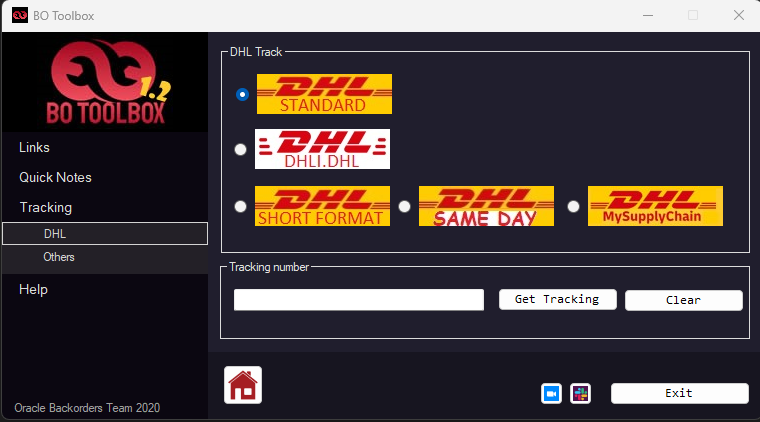

# Backorder Management System

C# multi-layered application designed to support backorder tracking, documentation, and operational workflow management in supply chain environments.

## Overview
This project was developed as a real-world internal tool to improve efficiency in backorder management processes. It centralizes tracking, documentation, and workflow handling in a structured system.

Configuration values are set for a development environment and do not reflect any real internal systems.

## Screenshots
## Screenshots

### Home Screen

### Internal Tools Links

### Sourcing notes translator

### Quick tracking

## Business Impact
- Improved team effectiveness by 30%  
- Enhanced operational visibility  
- Streamlined tracking and documentation processes  

## Architecture
The solution follows a layered architecture:

- **PL (Presentation Layer)** – User interface and interaction  
- **BLL (Business Logic Layer)** – Core business rules and processing  
- **DAL (Data Access Layer)** – Data handling and database interaction  

This structure ensures separation of concerns, maintainability, and scalability.

## Technologies
- C#
- .NET
- SQL
- WinForms

## Key Features
- Backorder tracking and monitoring  
- Workflow support for operational processes  
- Data management and documentation  
- Search and filtering capabilities  

## Learning Focus
This project demonstrates:
- Layered architecture design (DAL / BLL / PL)  
- Real-world problem solving through software  
- Data handling and process optimization  

## Notes
This project is based on a real-world internal tool. Any sensitive or proprietary information has been removed or anonymized.
